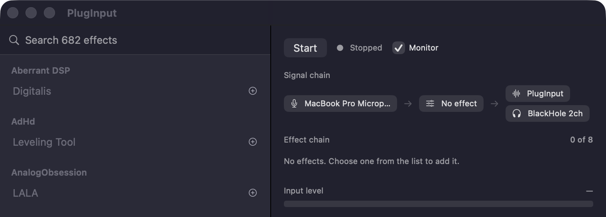

# PlugInput

Run audio plugins on your live microphone, then use the processed signal as a microphone in
any other app.

PlugInput is a macOS menu bar utility. Load a compressor, de-esser, EQ, or gate onto your
voice without opening a DAW, and Zoom, Discord, Slack, Teams, and OBS pick up the processed
signal directly.

```
microphone -> [ your effect chain ] -> PlugInput -> Zoom / Discord / OBS
                                            |
                                            +----> your headphones
```

<p align="center">
  
</p>

## Features

* Chain up to 8 Audio Unit effects, in any order, with per-effect bypass.
* Pick which input channel your microphone is on, for interfaces with more than one.
* Each plugin opens its own vendor interface. Several can be open at once.
* Settings, chain order, and device selection are saved and restored on launch.
* Optional headphone monitoring, independent of what other apps receive.
* Latency readout, input level meter, and an activity log.
* Works alongside an existing BlackHole installation.

## Requirements

macOS 14 (Sonoma) or later, on Apple silicon or Intel.

## Installation

Download the latest `PlugInput-<version>.pkg` from [Releases](../../releases) and run it. It
installs the app to `/Applications` and an audio driver to `/Library/Audio/Plug-Ins/HAL`, then
restarts CoreAudio so the device appears immediately.

On first launch macOS asks for microphone access. PlugInput captures nothing until you grant
it.

To remove everything later:

```bash
/Applications/PlugInput.app/Contents/Resources/uninstall.sh          # app and driver
/Applications/PlugInput.app/Contents/Resources/uninstall.sh --all    # also delete settings
```

## Usage

1. Click the waveform icon in the menu bar.
2. Choose your **Input**. On an interface with several inputs, pick the **Channel** your
   microphone is plugged into.
3. Open the **Effect chain**, search your installed Audio Units, and click one to add it.
4. Press **Start**.
5. In Zoom, Discord, or OBS, select **PlugInput** as the microphone.

Effects that fail to load stay in the chain with their saved settings. Use **Retry** in the
chain editor to load them again; unavailable effects do not process audio.

Effects process top to bottom, and the same plugin can appear more than once. Use **Up/Down**
to reorder, **Bypass** to remove an effect from the signal while keeping its settings, the
**sliders** to open its interface, and the **trash** to delete it. Bypass is instant; adding,
removing, and reordering rebuild the audio graph and cause a brief dropout.

The latency display separates the requested **125 ms capture buffer** from reported effect
latency. This is not a measured end-to-end delay; device buffering adds more. Monitoring
therefore has an audible delay even without effects.

The **Monitor** checkbox controls whether you hear yourself, and does not affect what other
apps receive. Turn it off on speakers, or the output feeds back into the microphone — loudly,
with a compressor in the chain. Turning it off also stops PlugInput opening your output device
at all, which matters if you share an interface with a DAW.

## Troubleshooting

**No sound reaching other apps.** Usually microphone permission: macOS returns silence rather
than an error when access has not been granted, and every layer reports success. Check System
Settings > Privacy & Security > Microphone.

**PlugInput became your system microphone.** macOS sometimes makes a newly installed device
the default input, so apps following the default hear silence. PlugInput offers a one-click
fix in its menu, or set it back under System Settings > Sound > Input.

**Seeing what the app is doing.** A menu bar app has no console, so PlugInput writes to the
unified log. The Activity panel in the window shows the same transcript.

```bash
/usr/bin/log show --last 5m --info --predicate 'subsystem == "com.pluginput.app"' --style compact
```

**Resetting.** Delete `~/Library/Application Support/PlugInput/session.json` to return to
defaults.

## Limitations

* **Plugins load in process.** Out-of-process loading is AUv3 only, and most installed Audio
  Units are AUv2, so a plugin that crashes takes the app down with it. Settings are autosaved
  partly for this reason.
* **Eight effects maximum.** Each adds latency; the window shows a running total.
* **Audio Units only.** VST3 is not supported.

## Building from source

```bash
swift build && swift test     # library and unit tests
./make-driver.sh install      # build and install the audio driver (asks for sudo)
./make-app.sh release         # assemble PlugInput.app
open PlugInput.app
```

`make-app.sh` is required rather than cosmetic: a menu bar app needs `LSUIElement`, and macOS
grants microphone access only to a bundle whose `Info.plist` declares
`NSMicrophoneUsageDescription`. The raw SwiftPM binary gets a dock icon and silence.

`./make-pkg.sh` builds an installer; `--notarize` signs and notarizes it.

[ENGINEERING.md](ENGINEERING.md) documents the architecture and the failure modes found while
building it. Nearly all of them are silent — the audio stack reports success and delivers
nothing — so read it before changing device or channel-map code.

## Credits

PlugInput includes a modified build of
[BlackHole](https://github.com/ExistentialAudio/BlackHole) by Existential Audio, used as its
loopback driver and renamed so the device is identifiable. **This is not the official BlackHole
binary and is not supported by Existential Audio.** Please direct any issues with PlugInput
here rather than to them.

BlackHole is licensed under GPL-3.0. The corresponding source is BlackHole v0.6.1 together
with the build flags recorded in [`make-driver.sh`](make-driver.sh).

## License

PlugInput is released under the MIT License. See [LICENSE](LICENSE).

The bundled audio driver is a separate work under GPL-3.0, distributed alongside the app
rather than linked into it. See [THIRD-PARTY-LICENSES](THIRD-PARTY-LICENSES) for what was
modified and where to get the corresponding source. Its full license text also ships inside
the driver bundle.
